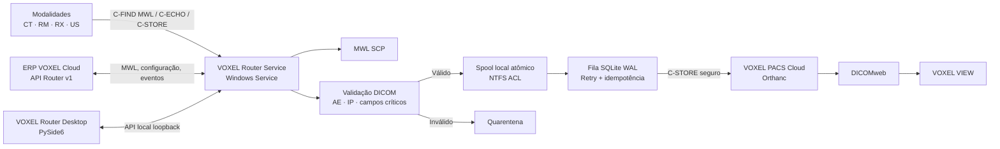

# VOXEL ROUTER DESKTOP — Arquitetura Proposta

**Versão proposta:** 1.0.0  
**Produto:** VOXEL ROUTER DESKTOP — *DICOM Gateway & Modality Worklist*  
**Status:** arquitetura para aprovação; nenhuma implementação do Router foi iniciada.

## 1. Escopo e fronteiras clínicas

O VOXEL Router Desktop será um **gateway DICOM local de clínica**, não um PACS, não um visualizador e não um substituto do Orthanc. Ele executará três funções clínicas delimitadas: disponibilizar Modality Worklist (MWL), receber instâncias por C-STORE em uma área local durável e encaminhá-las ao VOXEL PACS Cloud por fila persistente.

O Router não realizará Query/Retrieve, não alterará silenciosamente datasets e não dependerá da interface gráfica para receber ou transmitir exames. Qualquer dado inválido será rejeitado com status DICOM apropriado ou enviado à quarentena, conforme política configurável e auditável.

> **Princípio de integridade:** uma resposta C-STORE de sucesso só será devolvida à modalidade após a instância ser gravada de forma atômica no spool local e registrada na transação SQLite. Assim, uma queda de internet, de interface ou de processo não produz exame reconhecido pela modalidade e perdido pelo Router.

## 2. Pontos de integração já existentes

| Componente | Estado verificado | Uso pelo Router |
|---|---|---|
| Orthanc Cloud | AE `VOXELSRVPACS`, DICOM TCP `4242`, storage vazio em Volume Hetzner dedicado de 750 GB | Destino DICOM do encaminhamento das instâncias aprovadas. |
| DICOMweb Cloud | `https://dicom.voxelpacs.com.br/dicom-web`, funcional via gateway Nginx | Consulta/visualização posterior; não será exposto diretamente ao Router local. |
| API Orthanc privada | `10.0.0.3:8042`, restrita à origem privada `10.0.0.2` | Mantida interna; não será compartilhada com a clínica. |
| ERP VOXEL | Worklist de estudos, `OrthancService`, integração desktop já existente | Base para nova API de sincronização de MWL, eventos e configuração do Router. |
| Segurança Cloud | `4242/tcp` está disponível hoje para DICOM de entrada | Antes de produção, deverá usar VPN/allowlist por clínica e, quando homologado, TLS DICOM. |

A integração Cloud exigirá uma API nova, versionada e restrita a dispositivos Router. Não será permitido colocar usuário/senha Orthanc, token administrativo ou credenciais de banco no Router Desktop.

## 3. Opções de execução local

| Abordagem | Resultado | Pontos fortes | Limites |
|---|---|---|---|
| **A. Serviço Windows + painel separado** | Motor DICOM inicia com Windows e o painel apenas administra | Atende operação 24x7, fila offline e recuperação após reinicialização | Requer instalação de serviço e privilégios administrativos. |
| **B. Aplicação desktop em primeiro plano** | O DICOM funciona somente enquanto a janela está aberta | Instalação inicial mais simples | Não atende requisito de continuidade, reinicialização ou operação clínica 24x7. |

A alternativa A é a única compatível com os requisitos obrigatórios de fila offline, reinicialização e independência da interface.

## 4. Arquitetura de processos



O processo `VOXEL Router Service` será a única unidade que abre portas DICOM, escreve no spool, acessa a fila e transmite estudos. A aplicação PySide6 consumirá uma API local protegida em `127.0.0.1`; fechar o painel não interfere no serviço.

## 5. Estrutura de diretórios

```text
voxel-router-desktop/
├── app/
│   ├── api/                 # FastAPI em loopback e autenticação local
│   ├── audit/               # auditoria e retenção
│   ├── config/              # configuração validada e DPAPI
│   ├── core/                # bootstrap, erros, health, versionamento
│   ├── database/            # SQLite, migrations, repositories
│   ├── dicom/
│   │   ├── echo/            # Verification SCP/SCU
│   │   ├── mwl/             # Modality Worklist C-FIND SCP
│   │   ├── scp/             # associação e C-STORE SCP
│   │   └── scu/             # C-STORE Cloud e C-ECHO destinos
│   ├── queue/               # spool, dispatcher, retry e idempotência
│   ├── router/              # regras de origem/destino
│   ├── security/            # RBAC, ACL, segredo DPAPI, IP/AE allowlist
│   ├── services/            # cloud sync, health, métricas
│   └── validation/          # dataset, SOP Class e quarentena
├── desktop/
│   ├── components/
│   ├── dialogs/
│   ├── resources/
│   └── views/
├── docs/
├── installer/
├── migrations/
├── tests/
├── pyproject.toml
├── requirements.txt
└── README.md
```

No computador da clínica, os dados operacionais ficarão em `C:\ProgramData\VOXEL\Router\`, segregando `spool`, `quarantine`, `logs`, `sqlite` e `config`. ACL NTFS limitará leitura/escrita ao serviço e administradores autorizados.

## 6. Modelo SQLite local

| Domínio | Tabelas principais | Garantias |
|---|---|---|
| Identidade e agenda | `patients`, `orders`, `worklist` | `PatientID`, `AccessionNumber`, Station e data indexados. |
| Topologia | `modalities`, `destinations`, `routing_rules` | AE Title normalizado, IP/CIDR permitido, porta, TLS, estado e última verificação. |
| DICOM | `studies`, `series`, `dicom_instances` | `SOPInstanceUID` único, Study/Series UID indexados, hashes e caminhos de spool. |
| Fila | `queue`, `queue_attempts` | estados persistentes, backoff exponencial, lease e retomada pós-crash. |
| Segurança | `users`, `roles`, `settings`, `audit_logs`, `system_logs` | RBAC, trilha de mudanças, retenção e redaction. |
| Quarentena | `quarantine_items` | motivo, origem, caminho, decisão administrativa e reprocessamento auditado. |

SQLite será configurado em WAL, `foreign_keys=ON`, transações curtas e migrations versionadas. A deduplicação será feita por `SOPInstanceUID` e hash de conteúdo; estudos/séries serão usados apenas como agrupadores, nunca como chave exclusiva de instância.

## 7. Fluxos DICOM

### 7.1 MWL — C-FIND SCP

1. A modalidade estabelece associação para o AE e porta MWL configurados.
2. O Router valida Calling AE e IP permitido.
3. O Router pesquisa agenda local sincronizada pela API Cloud, aplicando filtros suportados: Station AE, modalidade, data e identificadores de paciente/procedimento.
4. Cada resultado é retornado com `ScheduledProcedureStepSequence` completo e status DICOM pendente/sucesso.
5. Consultas e respostas são auditadas sem registrar conteúdo sensível em log técnico.

### 7.2 C-STORE SCP

1. A associação é aceita apenas para AE/IP autorizados e SOP Classes permitidas.
2. O dataset é validado: Patient ID, Patient Name, Study/Series/SOP UID, SOP Class, Modality, Accession, Study Date e Institution Name.
3. A instância é escrita como `.part`, sincronizada e renomeada atomicamente no spool.
4. Uma transação SQLite registra instância, série, estudo e item de fila.
5. O SCP responde sucesso somente após as etapas anteriores; falha de persistência devolve status DIMSE de erro e não confirma recebimento.
6. Dados incompletos seguem política explícita de rejeição ou quarentena; nenhuma normalização silenciosa é permitida.

### 7.3 Fila e roteamento Cloud

1. O dispatcher seleciona itens confirmados e não processados.
2. Regras combinam Calling AE, Institution Name, modalidade, Station e destino ativo.
3. A transmissão C-STORE para o Cloud ocorre por associação configurada e recebe status DIMSE verificável.
4. Sucesso atualiza a instância e permite política de retenção do spool; falha agenda retry exponencial com limite, mantendo o arquivo local.
5. A ausência de internet não interrompe MWL nem C-STORE local; apenas acumula itens na fila.

## 8. API Cloud e API local

### API Cloud Router v1 — a implementar no ERP

| Endpoint conceitual | Propósito | Segurança |
|---|---|---|
| `POST /api/router/v1/devices/register` | Parear Router com tenant/unidade | token de ativação curto, aprovação administrativa e certificado/dispositivo. |
| `GET /api/router/v1/worklist/sync` | Sincronizar agenda incremental | token de dispositivo rotativo, tenant obrigatório, cursor assinado. |
| `POST /api/router/v1/events` | Recebimento, encaminhamento, falha e saúde | lote assinado, idempotência por `event_id`. |
| `GET /api/router/v1/config` | Obter destinos e regras aprovadas | versão, hash e validação de esquema. |

A API do Cloud não transportará o arquivo DICOM na primeira versão. O trânsito clínico seguirá por DICOM C-STORE do Router para o endpoint Cloud. A evolução para STOW-RS poderá ser adicionada depois de homologação própria.

### API local do serviço

A FastAPI ficará em loopback, com token local rotativo e autorização do usuário Windows. Entregará `health`, `status`, `worklist`, `modalities`, `destinations`, `queue`, `logs` e operações administrativas. Ela não deverá aceitar conexões externas.

## 9. Segurança

| Controle | Implementação proposta |
|---|---|
| Credenciais | Windows DPAPI + arquivos ACL restritos; nunca texto puro ou código. |
| Acesso ao painel | usuário local, senha administrativa com Argon2id, RBAC e expiração de sessão. |
| Associações DICOM | allowlist AE/IP/CIDR, Called AE obrigatório, limite de associações e timeout. |
| Transporte Cloud | VPN/allowlist obrigatória antes de produção; TLS DICOM somente após certificado e conformance homologados. |
| Dados em disco | spool com ACL, hash, retenção e limpeza somente após confirmação de envio/política. |
| Auditoria | evento imutável de configurações, C-ECHO, C-FIND, C-STORE, fila, retry, login e quarentena. |
| Logs | redaction de nomes, documentos e segredos; IDs clínicos restritos à auditoria autorizada. |

## 10. Interface e identidade VOXEL

A interface PySide6 adotará o nome **VOXEL ROUTER DESKTOP**, subtítulo **DICOM Gateway & Modality Worklist**, navegação lateral e telas: Dashboard, Worklist, Modalidades, Router, Fila, Logs, Auditoria, Quarentena, Configurações e Sobre.

O Dashboard apresentará saúde do serviço, MWL, C-STORE, Cloud, fila, disco e destinos. A identidade visual será VOXEL PACS, sem referência à biblioteca DICOM, framework Python ou ferramentas de empacotamento ao usuário final. Antes do design final, será necessário anexar o arquivo mestre do logotipo VOXEL (SVG/PNG) ou autorizar o reaproveitamento do ativo existente no repositório web.

## 11. Empacotamento e serviço Windows

O motor será empacotado com Python 3.12, `pydicom`, `pynetdicom`, FastAPI, SQLite e dependências fixadas por lockfile. O instalador profissional instalará binários, migrations, diretórios ProgramData, serviço Windows, desinstalador e atalhos.

A opção recomendada é serviço Python registrado por `pywin32`, com recovery automático do Windows e painel PySide6 separado. O instalador incluirá pré-checagem de porta, permissões, espaço em disco e configuração inicial. A implementação não será validada clinicamente até a homologação por modalidade e fabricante.

## 12. Plano de testes

| Camada | Testes obrigatórios |
|---|---|
| Banco/fila | migrations, WAL, crash recovery, deduplicação, concorrência e retomada. |
| DICOM | C-ECHO, C-FIND MWL, Scheduled Procedure Step, C-STORE, SOP Classes, transfer syntaxes, status de erro. |
| Validação | tags críticas ausentes, Called/Calling AE inválidos, IP fora de allowlist, dataset duplicado, quarentena. |
| Rede | destino indisponível, timeout, associação recusada, TLS configurado/ausente. |
| Resiliência | 10 estudos com internet indisponível: 10 recebidos, 10 enfileirados, 0 perdidos; posterior envio após retorno. |
| Reinicialização | serviço interrompido/reiniciado com itens em fila, retomada sem perda ou duplicação. |
| Segurança | segredo inacessível ao usuário comum, API local sem acesso externo, logs redigidos, RBAC. |
| Integração Cloud | idempotência de eventos, sync de MWL por tenant, C-ECHO Cloud e transmissão a Orthanc de homologação. |

## 13. Entrega e Git

O projeto será inicializado localmente com Git, `.gitignore` para segredos, banco, spool, build e logs, e commits semânticos. Ao final, ficará pronto para o repositório privado proposto `ASOARESBH/voxel-router-desktop`; nenhuma credencial, arquivo DICOM ou banco local será versionado.

## 14. Decisões necessárias antes da implementação

1. Aprovar esta arquitetura Serviço Windows + painel PySide6 + SQLite + API local.
2. Definir se o logotipo oficial será anexado ou se pode ser reaproveitado do repositório web atual.
3. Confirmar o repositório privado proposto `ASOARESBH/voxel-router-desktop` ou informar outro nome/organização.
4. Vincular uma pasta de desenvolvimento para o projeto desktop, se desejar que os arquivos sejam produzidos diretamente em seu computador; caso contrário, a implementação será construída e testada no ambiente de desenvolvimento e entregue em pacote Git.
5. Aprovar a etapa inicial sem TLS DICOM ativo, usando VPN/allowlist como pré-requisito de homologação antes da entrada em produção. TLS DICOM será implementado após certificados e endpoints homologados.

## Referências

[1]: https://pydicom.github.io/pynetdicom/stable/examples/basic_worklist.html "pynetdicom — Basic Worklist Management Service Examples"
[2]: https://pydicom.github.io/pynetdicom/dev/tutorials/create_scp.html "pynetdicom — Writing your first SCP"
[3]: https://pydicom.github.io/pynetdicom/stable/tutorials/create_scu.html "pynetdicom — Writing your first SCU"
[4]: https://dicom.nema.org/medical/dicom/current/output/chtml/part04/chapter_K.html "DICOM PS3.4 — Basic Worklist Management Service"
